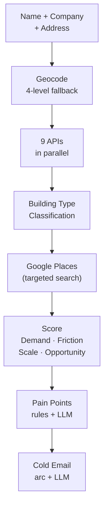
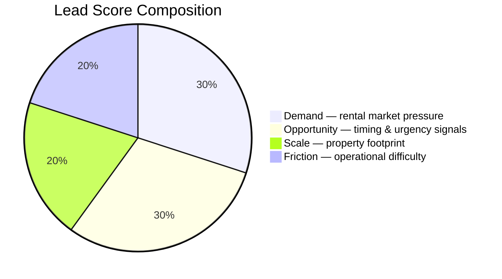

# GTM Automation Tool

> Give it a name, an address, and a company. In under 60 seconds you get a scored lead, specific pain points, and a cold email grounded in real data — ready to review and send.

---

## The Problem

An SDR prospecting property management companies needs to answer five questions before writing a single email: Is this a real rental market? Is this building big enough to matter? Is the company growing or struggling? Do residents have complaints? And is now a good time to reach out?

Doing that manually takes 25–45 minutes per lead. At 20 leads a day, most of the workday is gone before anyone picks up the phone. And because it's expensive, SDRs end up cherry-picking by instinct — a mid-size apartment complex in a tight Boston rental market gets the same treatment as a single-family home in a rural suburb.

This tool replaces all of that lookup work.

---

## How It Works



1. The address gets geocoded (Intellipins → Nominatim → US Census as fallbacks).
2. Nine APIs fire in parallel: US Census, FRED vacancy rates, WalkScore, OpenStreetMap, Intellipins parcel data, Open-Meteo climate, FBI crime, NewsAPI, and Wikipedia.
3. Building type is classified from OSM and Intellipins — then Google Places searches with the right strategy (apartment complexes get searched by address to find tenant reviews; commercial properties get searched by company name to find the management company's rating).
4. A deterministic scoring engine produces four sub-scores and a composite 0–100 Lead Score with grade A–F. **No LLM touches the score.**
5. A rule engine fires pain points. An LLM adds up to two nuanced insights. A second LLM writes a cold email in one of five story arcs — arc selection is also deterministic.

---

## Quick Start

```bash
cp .env.example .env           # fill in your API keys
pip install -r requirements.txt
source venv/bin/activate
uvicorn backend.main:app --reload
# open frontend/index.html in your browser
```

Backend runs at `http://localhost:8000`.

| Endpoint | What it does |
|----------|-------------|
| `POST /pipeline` | Full run: enrich → score → pain points → email → save |
| `POST /enrich` | Enrichment only, no scoring or email |
| `GET /leads` | Fetch saved lead history |
| `POST /dev/rescore/{id}` | Re-run scoring/email on a saved lead without re-enriching |

For re-scoring: body is `{"steps": "scoring,pain_points,outreach", "llm_provider": "anthropic"}`.

---

## Scoring Overview



**Demand** asks: how overwhelmed is this property manager with inbound activity right now?
**Opportunity** asks: is there a specific signal that makes this company likely to act — a bad Google rating, a news trigger, a Wikipedia-established brand?
**Scale** asks: is this a 20-floor apartment complex or a single-family rental?
**Friction** asks: how hard is this property to operate? High friction is good for us — it means the manager needs automation.

Scoring is fully deterministic and uses calibrated ceilings (e.g., Walk Score ceiling is 80, not 100 — "Very Walkable" should max the component, not get penalized against a ceiling no real lead ever hits) and shaped curves to push weak leads below 50 and strong leads above 80.

---

## Real Examples

### Grade A — 81.1 pts · Christopher Gonzalez · Inland American Real Estate · Chicago, IL

A 20-floor apartment complex at 40 E Oak St in the Gold Coast. Walk Score 99. Chicago winters (62.7 cm snow/yr, 178 rain days, -24°C lows). 54.4% renter share. Population 2.74M.

| Sub-score | Score | What's driving it |
|-----------|-------|-------------------|
| Demand | 89 | Near-perfect walkability, transit, and renter density in the third-largest US city |
| Friction | 90 | Heavy Chicago winters — constant maintenance communication load |
| Scale | 100 | 20-floor apartment complex, 102k sq ft parcel — full ICP match |
| Opportunity | 22 | No news trigger, decent Google rating — no behavioral signal to act on |

Arc selected: `operational_friction` · Subject: *Midnight Maintenance Calls*

> Your team deals with around 2 feet of snow and ~178 rainy days per year, which means constant maintenance issues. At Inland American Real Estate, a burst pipe during a cold snap can lead to a flooded lobby and numerous resident calls. EliseAI keeps residents informed automatically so your team can focus on the fix, not the calls.

---

### Grade D — 44.9 pts · Tyler Morales · Scottsdale Property Group · Scottsdale, AZ

A single-family house at 6839 E Montecito Ave. Google rating 4.8★ (100 reviews). 0.3 cm snow/year. 33.4% renter share. Building type score: 0.20.

The 4.8-star rating is the tell. This operator is running their property well without automation. Opportunity scores 0 — the high rating means no low_rating signal, and there's no news or Wikipedia presence to fire on. There's no pain to sell into. The model correctly identifies this as a skip.

---

## Documentation

| Doc | Audience | What's inside |
|-----|----------|---------------|
| [Business Overview](docs/01_business_overview.md) | CEO, Sales Leadership | Problem, scoring logic with all assumptions, full case studies, limitations, roadmap |
| [Pipeline & Architecture](docs/02_pipeline_architecture.md) | Engineering, RevOps | System diagram, API inventory, scoring formulas, batch strategy, A/B testing framework |
| [SDR Guide](docs/03_user_guide.md) | SDRs, SDR Managers | Setup walkthrough, input format, reading the output, troubleshooting |
| [Rollout Plan](docs/04_rollout_plan.md) | Revenue Leadership | 4-phase rollout, success metrics, cost breakdown |

An interactive visual version of all docs is at `frontend/docs.html` — open it in a browser for animated pipeline diagrams, the scoring chart, and hover-detail API cards.

---

## Key Design Decisions

**Why deterministic scoring, not an LLM judge?** Reproducibility. The same address always produces the same score. You can tune weights, audit decisions, and A/B test arc selection without worrying about prompt drift.

**Why partial-weight scoring?** Missing an API response shouldn't penalize a lead. If OSM fails, the scale score runs on what it has. Every sub-score ships with an `available_weight` so you know how much data backed the number.

**Why two LLM calls?** Zero means generic emails. Two (nuanced pain points → arc-aware email) means every email is grounded in the actual enrichment data for that property. The deterministic scoring layer constrains the LLM to numbers the system already verified — it can't make things up.
