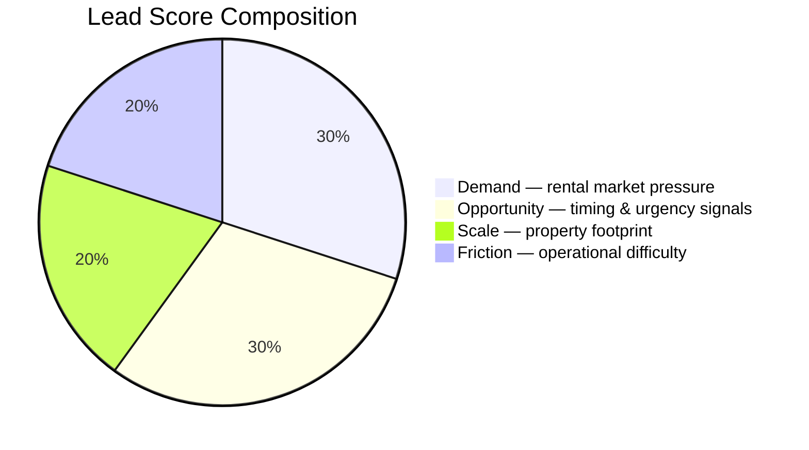

# Business Overview

> **Audience:** CEO, Sales Leadership, Revenue stakeholders

---

## The Problem

A typical SDR prospecting a property management company has to do a lot of legwork before they can write a single personalized email:

| Step | What they're doing | Time |
|------|-------------------|------|
| Research the company | Google, LinkedIn, news searches | 10–15 min |
| Qualify the market | Is this a real rental market? Is there demand? | 5–10 min |
| Assess the property | Apartment complex or single-family home? How large? | 5–10 min |
| Write the email | Generic template, lightly personalized | 5–10 min |
| **Total** | | **25–45 min per lead** |

At 20 leads per day, that's most of the workday gone before anyone picks up the phone. And because it's expensive, SDRs naturally cherry-pick by instinct — a mid-size apartment complex in a tight Boston rental market gets the same treatment as a single-family home in a rural suburb. The signal is there; there's just no time to read it.

---

## What the Tool Does

You give it a prospect's name, company, and property address. In 30–60 seconds, it does the following:

1. **Looks up the property** — confirms coordinates, building type (apartment complex vs. office vs. SFR), physical footprint, and lot size from property data APIs.

2. **Reads the local market** — pulls Census data (population, renter share, median income), FRED vacancy rates, and WalkScore to understand the rental demand environment.

3. **Checks the weather and crime** — not because we care about the weather, but because harsh climates and high crime directly increase the operational burden on property managers (more maintenance calls, more tenant communication, more resident turnover). That's exactly where EliseAI creates value.

4. **Scans recent news** — finds company announcements (expansions, cost cuts, lawsuits) that signal whether the timing is right and what angle to lead with.

5. **Checks Google reviews** — a 2.8-star property with 80 reviews is practically telling you that residents are unhappy with communication. That's an EliseAI problem.

6. **Scores the lead** — generates four sub-scores (Demand, Friction, Scale, Opportunity) and rolls them into a single 0–100 Lead Score with a grade (A through F).

7. **Names the pain** — identifies which operational problems this property likely has, ordered by severity.

8. **Writes the email** — selects one of five story arcs deterministically from scores and pain points (Reputation Gap, Operational Friction, Growth Strain, Premium Expectations, Lead Speed), then generates a cold outreach email grounded in the actual data points.

The SDR reviews the output, tweaks the email if needed, and sends. Total active time: under 5 minutes per lead.

---

## How the Score Is Built

Every lead gets scored across four dimensions. Together they answer the question: *is this the right company, at the right time, in the right market?*



```
Lead Score = (Demand × 0.30) + (Friction × 0.20) + (Scale × 0.20) + (Opportunity × 0.30)
```

Scores are fully deterministic — no LLM touches them. Missing data is handled gracefully: sub-scores are weighted in the composite proportionally to their `available_weight`. A sub-score with sparse data contributes less to the final number rather than being dropped or dragging the score down.

---

### Demand Score — 30%
*"How overwhelmed is this property manager likely to be with inbound rental activity?"*

A tight rental market with a lot of renters and high walkability means constant inquiry volume. The property manager is fighting fires all day — which is exactly when automation is most valuable.

| Signal | Weight | Ceiling | How it's shaped |
|--------|--------|---------|-----------------|
| Renter % of households | 25% | 50% renters | **Lifted** — high renter % is the baseline for target cities; we lift the mid-range to capture market depth |
| Vacancy rate (inverted) | 20% | 0–10% vacancy | **Lifted** — even moderate tightness (5%) is a high-intensity signal in the real world |
| Walk Score | 15% | **Score of 80** | **Crushed** — ceiling set at "Very Walkable" (80) so any property at that threshold maxes this component; car-dependent scores near zero |
| Transit Score | 10% | **Score of 75** | **Crushed** — ceiling set at "Excellent Transit" (75); low transit access is a major disqualifier |
| Median household income | 10% | $85k/year | **Lifted** — $85k is already a premium market |
| Nearby amenities (1km radius) | 12% | 40 amenities | **Lifted** — density indicators capped at realistic "busy" levels |
| Population | 8% | 250k | **Crushed** — small towns are heavily penalized to protect ICP focus |

---

### Friction Score — 20%
*"How hard is it to operate this property — and does that difficulty make EliseAI more valuable?"*

A high Friction score is a good thing for us. It signals operational stress: more maintenance calls, more tenant communication, more scheduling overhead. Friction tells you *why* a manager needs automation, not *whether* they do — that's why it carries less weight than Demand or Opportunity.

| Signal | Weight | Ceiling | How it's shaped |
|--------|--------|---------|-----------------|
| Crime score (1–15) | 25% | Score of 15 | **Crushed** — low crime areas score near zero friction |
| Precipitation days | 25% | 120 days/year | **Crushed** — very high precip (184+ days) maxes out; mild weather scores near zero |
| Annual snowfall | 20% | 80 cm/year | **Lifted** — snowfall is an indicator signal; any meaningful snow already signals friction; moderate NYC snowfall (~38 cm) should score ~60, not near zero |
| Temperature range | 20% | 55°C swing | **Crushed** — infrastructure stress proxy; wide swings are aggressively rewarded |
| Elevation | 10% | 800m | **Crushed** — harsh winter proxy |

---

### Scale Score — 20%
*"How big is the operational footprint? More units = more automation leverage."*

A 400-unit apartment complex in Seattle and a single-family rental in rural Montana are not the same opportunity. This score captures that difference.

| Signal | Weight | Ceiling | How it's shaped |
|--------|--------|---------|-----------------|
| Building type | 30% | Apartment Complex | Categorical lookup — see table below |
| Building footprint | 25% | 40,000 sq ft | **Crushed** — small buildings score near zero |
| Lot area | 20% | 100,000 sq ft | **Lifted** — mid-size parcels represent significant scale |
| Floors | 15% | 15 floors | **Crushed** — 1–2 floor buildings are aggressively penalized |
| Unit count | 10% | 250 units | **Crushed** — direct scale proxy |

**Building type lookup:**

| Building Type | Score |
|---------------|-------|
| Apartment Complex | 1.00 |
| Hotel | 0.80 |
| Commercial / Industrial | 0.75 |
| Office Building | 0.70 |
| Apartment / Shopping Complex | 0.65 |
| Shopping Complex / Amenity | 0.55 |
| Retail / Shopping | 0.45 |
| Single Family Housing | 0.20 |
| Unknown | 0.20 |

---

### Opportunity Score — 30%
*"Is there a specific trigger or opening that makes this company likely to act now?"*

This sub-score captures behavioral and reputational signals that Demand doesn't — things that tell you whether a company is *ready* to act, not just whether the market is right. Renter %, vacancy, and walkability are intentionally excluded here (they already appear in Demand) to avoid double-counting.

| Signal | Weight | Trigger | How it's shaped |
|--------|--------|---------|-----------------|
| News sentiment | 54% | Growth → 0.95 | **Decisive floor** — growth news is a primary trigger for Grade A prioritization |
| Low Google rating | 31% | 1 star → 1.0 | **Lifted** — rating pain is an indicator signal; a 3.0-star rating should score ~55, not ~43 |
| Wikipedia presence | 15% | Page found = 0.90 | **High floor** — established account indicator |

---

### The Engineering Defense: Why Scores Don't Cluster in the Middle

In multi-layered scoring systems, averaging naturally pulls leads into a narrow 50–65 band. To solve this, the engine uses a **Three-Part Calibration Strategy**:

1. **Ceiling Calibration** — Ceilings are set at realistic "strong" values, not theoretical maximums. Walk Score ceiling is 80, not 100. A score of 84 is "Very Walkable" and should max out this component — not get penalized against a ceiling no US property ever reaches.

2. **Concave Lifting** (`x^0.70`) — Applied to indicator signals like renter share, vacancy, snowfall, and low Google rating. These are signals where moderate values already represent meaningful intent. Lifting them ensures quality mid-range signals push leads into the 65–85+ range.

3. **Convex Penalization** (`x^2.0`) — Applied to structural filters like Walk Score, population, and building footprint. A Walk Score of 50 should score 0.25, not 0.50. This pushes weak leads below the 50 mark.

The result is a **high-dynamic-range score** — a real spread of ~65 points that makes automated prioritization meaningful.

---

## The Grade System

| Grade | Score | What to do |
|-------|-------|------------|
| A | 80–100 | Strong ICP match. Route to AE immediately. |
| B | 65–79 | Good fit. High-priority outreach. |
| C | 50–64 | Qualified but not urgent. Standard sequence. |
| D | 35–49 | Weak fit. Low-touch or hold. |
| F | 0–34 | Not ICP. Skip. |

---

## What Good and Bad Leads Look Like

These are real pipeline runs from the test dataset — actual API responses, actual scores, actual generated emails.

---

### Grade A — 81.1 pts · Christopher Gonzalez · Inland American Real Estate · Chicago, IL

**Property:** 40 E Oak St, Gold Coast — 20-floor apartment complex

| Signal | Value | What it means |
|--------|-------|---------------|
| Walk Score | **99** — Walker's Paradise | Every amenity within walking distance; inquiry volume is relentless |
| Transit Score | **92** — Rider's Paradise | Tenants move in and out constantly; turnover is high |
| Renter share | **54.4%** | Majority-renter city; the ICP market is there |
| Population | **2,742,119** | Third-largest US city; no scale concern |
| Annual snowfall | **62.7 cm** | Heavy Chicago winters; maintenance coordination load is real |
| Precipitation days | **178 days/yr** | Nearly half the year brings a weather event requiring tenant comms |
| Temperature swing | **-24°C to 35.7°C** | 60°C range; infrastructure stress year-round |
| Vacancy rate | **5.7%** | Tight market; every missed inquiry costs a lease |

**Scores:** Demand **89.4** · Friction **89.7** · Scale **100** · Opportunity **21.9** → **Lead Score: 81.1 — Grade A**

**Pain points identified:**
- [HIGH] Core ICP — 20-floor apartment complex, EliseAI's primary target
- [HIGH] Walk Score 99 drives constant inquiry volume; manual handling loses leases
- [HIGH] 62.7 cm snow + 178 rain days = continuous maintenance communication burden
- [MEDIUM] Transit Score 92 in a 54% renter market means high turnover and a full inquiry pipeline at all times

**Generated email** *(arc: operational\_friction)*

> **Subject:** Midnight Maintenance Calls
>
> Your team deals with around 2 feet of snow and ~178 rainy days per year, which means constant maintenance issues. This creates a reactive environment where your team is always on call to fix something.
>
> At Inland American Real Estate, a burst pipe during a cold snap can lead to a flooded lobby and numerous resident calls, taking your team away from the actual fix. EliseAI keeps residents informed automatically so your team can focus on the fix, not the calls.
>
> Worth a call?

**Why this is right:** Every EliseAI use case applies — leasing automation (99 Walk Score drives constant inquiries), maintenance coordination (Chicago winters), and tenant communication at scale (20-floor building). Opportunity scores low (21.9) because there's no news trigger, no Wikipedia page, and a decent Google rating (4.1★) — no behavioral signal to act on right now. The Demand and Scale scores alone are enough to push it into Grade A.

---

### Grade B — 79.7 pts · Anna Miller · Kairoi Residential · New York, NY

**Property:** 152 E 81st St, Upper East Side

| Signal | Value | What it means |
|--------|-------|---------------|
| Walk Score | **84** — Very Walkable | Urban core; renters have options and high expectations |
| Transit Score | **83** — Excellent Transit | High turnover; constant new-inquiry volume |
| Renter share | **66.8%** | Highest in the dataset; NYC is a renter's market |
| Population | **8,736,047** | Largest US city; market depth is unlimited |
| Google rating | **3.0★ / 120 reviews** | The pain signal — at scale, poor ratings are documented service failures |
| Sample review | *"I called at 2am for an emergency alarm going off and the staff told me they would tell maintenance in the morning."* | This is exactly the problem EliseAI solves |
| Precipitation days | **184 days/yr** | Constant weather-driven maintenance coordination |

**Scores:** Demand **90.6** · Friction **81.0** · Scale **65** · Opportunity **55.3** → **Lead Score: 79.7 — Grade B**

**Pain points identified:**
- [HIGH] NYC density + Transit 83 = relentless inquiry volume
- [HIGH] 184 rain days/yr — highest in this dataset
- [HIGH] 3.0★ across 120 reviews reflects documented slow response and unresolved maintenance
- [MEDIUM] Transit 83 in a 67%-renter city means high churn and a full leasing pipeline

**Generated email** *(arc: reputation\_gap)*

> **Subject:** Your Google Rating
>
> Your Google rating is 3 out of 5, which signals to a prospective renter that your team may have slow maintenance response before they ever call.
>
> At Kairoi Residential, a maintenance request like the one from a resident who called at 2:00am for an emergency alarm can go unacknowledged for days, leading to a frustrated review. EliseAI provides instant ticket acknowledgment and 24/7 automated tenant updates.
>
> Worth a call?

**Why this is right:** The 3.0★ Google rating across 120 reviews is the story. The pipeline correctly identified this as a reputation gap and pulled the exact type of review (2am emergency ignored) to anchor the email. High-priority outreach.

---

### Grade C — 57.5 pts · Joyce Reyes · MAA · Orem, UT

**Property:** 1633 S Main St, Orem

| Signal | Value | What it means |
|--------|-------|---------------|
| Walk Score | **45** — Car-Dependent | Structurally penalized; low walkability = lower inquiry volume |
| Transit Score | **43** — Some Transit | Weak transit access; further penalizes demand |
| Renter share | **39.5%** | Below the 50% ceiling; thinner market than ICP target cities |
| Population | **96,734** | Small city; demand score crushed vs. 250k ceiling |
| Annual snowfall | **251 cm/yr** | Highest in the dataset — over 8 feet of snow |
| Precipitation days | **149 days/yr** | Heavy weather load despite small city |
| Building type | **Single Family Housing** | Type score 0.20; not EliseAI's primary ICP |
| Google rating | Not found | No Google Places listing found |

**Scores:** Demand **58.6** · Friction **73.1** · Scale **34.7** · Opportunity **0** → **Lead Score: 57.5 — Grade C**

**Pain points identified:**
- [HIGH] 251 cm of snow (8+ feet) and 149 rain days — the single strongest signal here
- [MEDIUM] Wide temp swings add maintenance burden year-round
- [MEDIUM] Transit Score 43 limits tenant pool and signals a lower-demand rental environment

**Why this is right:** The friction signal is genuinely strong (8 feet of snow is real operational pain), but the small-city population and SFH building type cap the ceiling. Opportunity scores 0 because there's no Google listing, no news hits, and no Wikipedia page — no behavioral signal available. Standard sequence — worth reaching out, but not a priority over Grade A/B leads.

---

### Grade D — 44.9 pts · Tyler Morales · Scottsdale Property Group · Scottsdale, AZ

**Property:** 6839 E Montecito Ave — Single-family house

| Signal | Value | What it means |
|--------|-------|---------------|
| Walk Score | **69** — Somewhat Walkable | Decent, but below the 80 "Very Walkable" ceiling |
| Transit Score | **46** — Some Transit | Weak transit; structurally penalized |
| Renter share | **33.4%** | Below 50% ceiling; owner-majority market |
| Building type | **Single Family Housing** | Type score 0.20; fundamentally wrong ICP |
| Building footprint | **3,686 sq ft** | Tiny; Scale score near zero |
| Annual snowfall | **0.3 cm** | Scottsdale is sunny and dry; near-zero friction |
| Precipitation days | **49 days/yr** | Easy climate to operate — the opposite of a friction trigger |
| Google rating | **4.8★ / 100 reviews** | Residents are happy. No pain signal to sell into. |

**Scores:** Demand **68.6** · Friction **39.1** · Scale **34.9** · Opportunity **0** → **Lead Score: 44.9 — Grade D**

**Why this is right:** The 4.8-star Google rating is the tell. A manager with 100 happy reviews in a sunny climate with a small footprint is running their operation well without automation. Opportunity scores 0 — the high rating produces near-zero low_rating signal, and there's no news or Wikipedia presence. There's no pain to sell into. Skip.

---

## Where Not to Trust the Output

Sales leadership needs to know where this tool's blind spots are.

| What you might see | Why it happens | What to do |
|--------------------|---------------|------------|
| **Vacancy rate is state-level** | FRED doesn't publish city-level vacancy consistently | Treat it as a market signal, not a property-specific measurement |
| **No unit count for most properties** | OSM building tags rarely include unit counts; Scale uses footprint as a proxy | When a lead is borderline, verify unit count manually before calling |
| **News is company-level, not property-level** | NewsAPI searches by company name | For large REITs, scan the news snippets yourself before using them in the email |
| **Google Places may match the wrong listing** | The tool searches by address first, then company name; large companies may match a corporate office | Check `matched_via` in the output — if it says `company`, verify the rating is for a property, not an office |
| **Crime data missing for some cities** | FBI data is by police agency; small towns without their own PD may have no data | When crime is missing, friction runs on weather only — still valid |
| **Each lead is scored on one address** | The tool is not portfolio-aware | For enterprise accounts, enter the most prominent property and lean on company-level signals |
| **The email is a draft** | Claude Sonnet or Groq llama-3.3-70b generates it from real data, but tone is a starting point | Always read the email before sending. The pain point evidence is real; the language isn't final |
| **Data is not real-time** | Census is 2021 ACS; climate is 2024 archive; crime is typically 1–2 years behind | Use for directional assessment; supplement with Zillow or CoStar for deals where freshness matters |

---

## What We'd Build Next

| Priority | Feature | Why it matters |
|----------|---------|----------------|
| **High** | **Portfolio-level scoring** — upload a CSV of 50 properties for one company | Enables enterprise account prioritization, not just single-address scoring |
| **High** | **CRM integration (Salesforce / HubSpot)** — auto-push scored leads, auto-update on refresh | Eliminates the CSV handoff and keeps data current |
| **High** | **City-level vacancy via Zillow or CoStar** | Replaces state-level FRED proxy with actual local market data |
| **Medium** | **Explicit unit count lookup** via CoStar or county assessor | Makes Scale score significantly more precise |
| **Medium** | **Sequence integration** — auto-add Grade A/B leads to Outreach.io with the email pre-loaded | Reduces SDR active time from 5 min to under 1 min per lead |
| **Medium** | **Score refresh on trigger** — re-score automatically when a news event fires or Google rating changes | Keeps the lead list fresh without re-running manually |
| **Low** | **Competitive signal detection** — flag when a company is already on Yardi, RealPage, or Entrata | Adjusts the email angle from "here's a new tool" to "here's why to switch" |
| **Low** | **Multi-language support** | Expands serviceable markets in Miami, LA, and Houston |
