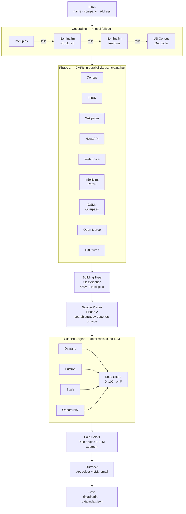

# Pipeline & Architecture

> **Audience:** Engineering, RevOps, anyone who inherits or extends this system.

---

## The Short Version

A lead comes in as a name + address. The system geocodes it, fires 9 API calls in parallel, derives building type from those results, then calls Google Places with the right search strategy for that property type. It scores everything deterministically, runs a rule-based pain point engine (then adds up to 2 LLM-generated insights), and generates the outreach email. The whole thing takes 20–60 seconds and saves a full JSON record.



---

## API Inventory

Thirteen external services, all with graceful fallbacks. If a key is missing or a request fails, that signal is excluded from scoring — the pipeline never crashes on a missing API.

| API | What it provides | Free tier | Rate limit | Auth |
|-----|-----------------|-----------|------------|------|
| **US Census Bureau ACS 5-Year** | Population, median income, renter % by city | Free, no enforced quota | ~500 req/day recommended | Optional API key |
| **FRED (St. Louis Fed)** | State-level rental vacancy rate | Free | 1,000 req/day | API key required |
| **WalkScore API** | Walk, transit, bike scores for address | 5,000 req/day free; $0.0025/req above | 5,000/day | API key required |
| **Intellipins** | Geocoding, parcel data, building type, elevation | No free tier | ~1 req/sec | API key (`X-API-KEY` header) |
| **Nominatim (OSM)** | Geocoding fallback, building footprint | Free (public instance) | **1 req/sec max — hard limit** | No key; User-Agent header required |
| **Overpass API (OSM)** | Building geometry, nearby amenity counts | Free (public instance) | Soft-throttled; ~3 sec between queries | No key; User-Agent header required |
| **Open-Meteo Archive** | Historical climate for 2024 (precip, snow, temp) | Free; 10,000 req/day | 10,000/day | No key required |
| **FBI Crime Data Explorer** | City-level crime rates per 100k | Free | No documented limit | API key required |
| **NewsAPI** | Company news and press releases | 100 req/day free; 1,000/day developer plan | 100/day free tier | API key required |
| **Wikipedia REST API** | Company/city summary text | Free | Practically unlimited | No key; User-Agent header required |
| **Google Places API** | Apartment: complex tenant reviews. Other: leasing company's nearest office rating | $200/month free credit (~11,700 text searches) | Default 10 QPS | API key required |
| **Anthropic (Claude Haiku)** | Pain point LLM enrichment | None (pay-per-use) | 50 req/min on Tier 1 | API key required |
| **Anthropic (Claude Sonnet)** | Outreach email generation | None (pay-per-use) | 50 req/min on Tier 1 | Same key as Haiku |
| **Groq API** *(alternative)* | Both LLM steps using open-source models | Generous free tier | 30 req/min free tier | API key; set `llm_provider=groq` |

---

## A Full Pipeline Trace

Here's exactly what happens for a single lead. This is the most useful thing to read if you're debugging or extending the pipeline.

### The request

```json
{
  "name": "Jordan Lee",
  "email": "jlee@greystar.com",
  "company": "Greystar",
  "property_address": "1600 Vine St",
  "city": "Los Angeles",
  "state": "CA",
  "enabled_apis": null,
  "llm_provider": "anthropic"
}
```

`enabled_apis: null` runs everything. Pass a list like `["census", "walkscore", "crime"]` to restrict which APIs run — useful for testing or debugging specific signals.

### Step 1: Geocoding

`_geocode_address("1600 Vine St", "Los Angeles", "CA")` tries Intellipins first. On success, it returns `(lat, lon, "intellipins", ipins_data_dict)`. The Intellipins data dict is passed directly into the parcel lookup — the service is called only once.

If all four geocoders fail, `lat` and `lon` are `None`. The four coordinate-dependent APIs (WalkScore, OSM, Open-Meteo, Intellipins parcel) are skipped. The other five (Census, FRED, Wikipedia, News, FBI) still run. Google Places still runs for non-apartment properties since it only needs city/state for the company name search.

### Step 2: 9 APIs fire in parallel

`asyncio.create_task()` is called for each API except Google, then `asyncio.gather()` awaits all of them. Google is excluded here because its search strategy depends on building type, which isn't known until OSM and Intellipins results come back.

### Step 3: Building type classification, then Google

After phase 1 completes, `_classify_building_type()` reads OSM tags and the Intellipins `address_type` field. That result drives the Google Places search:

- **Apartment Complex** — searches `{address}, {city}, {state}`. Finds the apartment's own Google listing with tenant reviews and star ratings.
- **Any other type** — searches `{company} {city} {state}` with a 50 km location bias. Finds the leasing company's nearest office. Searching by address for a retail property would return irrelevant reviews (a Walmart's shopper reviews instead of the property manager's rating).

There's no latency penalty: OSM takes 5–15 seconds. Google takes 1–2 seconds. By the time phase 1 finishes, Google would have been done long ago.

### Step 4: Results are assembled

After both phases complete, results are keyed by API name. `_nullify()` recursively converts `"N/A"`, `""`, and `"Data unavailable"` strings to `null` before passing to the scorer.

### Step 5: Scoring

`compute_all_scores(enrichment)` calls four independent sub-scorers. Each normalizes signals to 0–1 using the formulas below and runs a partial-weight average. Missing signals shrink the denominator — they don't penalize the score. Each sub-score's contribution to the composite is then scaled by its `available_weight`, so a sub-score backed by sparse data contributes proportionally less.

### Step 6: Pain points

`_rule_based_pain_points()` evaluates ~10 if-conditions against score values and enrichment data. Each fires independently. Then Claude Haiku (or Groq llama-3.1-8b) receives this list plus raw enrichment context and appends up to 2 additional insights grounded in specific numbers.

### Step 7: Email generation

`outreach.py` first selects a story arc deterministically from scores and pain point tags — one of five: `reputation_gap` (low Google rating), `operational_friction` (high friction + climate/crime), `growth_strain` (growth news), `premium_expectations` (premium market), or `lead_speed` (default). **No LLM selects the arc.** It then builds an arc-specific context block containing only the facts relevant to that story.

Claude Sonnet (or Groq llama-3.3-70b) receives the arc context, arc-specific narrative instructions, and writing rules (US units, no buzzwords, round numbers naturally). It returns JSON `{subject, message}`.

### Step 8: Save

`save_lead()` writes the full record to `data/leads/{uuid}.json` and appends a summary row to `data/index.json`.

---

## Scoring Rubric — Full Reference

These are the exact formulas used. If you're tuning weights or adding new signals, this is the spec.

Two curve functions are used throughout:
- `lift(x) = x^0.70` — concave curve that boosts mid-range values. Applied to indicator signals where moderate values already mean something.
- `crush(x) = x^2.0` — convex curve that penalizes weak values. Applied to structural filters where low values should score near zero.

### Demand Score (final weight: 30%)

| Signal | Weight | Normalization | Note |
|-----------|--------|---------------|------|
| renter_pct | 0.25 | `lift(min(renter_pct / 50.0, 1.0))` | City-level from Census ACS |
| low_vacancy | 0.20 | `lift(max(0, 1.0 - vacancy / 10.0))` | |
| walk_score | 0.15 | `crush(min(walk / 80.0, 1.0))` | Ceiling 80 = "Very Walkable"; score ≥80 maxes out |
| transit_score | 0.10 | `crush(min(transit / 75.0, 1.0))` | Ceiling 75 = "Excellent Transit" |
| income | 0.10 | `lift(min(income / 85000, 1.0))` | |
| nearby_amenities | 0.12 | `lift(min(total_amenities / 40.0, 1.0))` | Sum of OSM transit + parks + retail within 1km |
| population | 0.08 | `crush(min(population / 250000, 1.0))` | City-level; any city ≥250k maxes out |

### Friction Score (final weight: 20%)

| Signal | Weight | Normalization | Note |
|-----------|--------|---------------|------|
| crime | 0.25 | `crush((crime_score - 1.0) / 14.0)` | Low crime = near-zero friction |
| precip_days | 0.25 | `crush(min(precip_days / 120.0, 1.0))` | Mild weather leads score near zero |
| snowfall | 0.20 | `lift(min(snowfall_cm / 80.0, 1.0))` | **Indicator** — any meaningful snow signals friction; moderate NYC snowfall (~38 cm) scores ~59 |
| temp_range | 0.20 | `crush(min(temp_range / 55.0, 1.0))` | hottest_day - coldest_day |
| elevation | 0.10 | `crush(min(elevation_m / 800.0, 1.0))` | |

### Scale Score (final weight: 20%)

| Signal | Weight | Normalization | Note |
|-----------|--------|---------------|------|
| building_type | 0.30 | Lookup table (SFH = 0.20) | |
| footprint | 0.25 | `crush(min(area_sqft / 40000, 1.0))` | **Skipped** for Apartment Complex types when footprint < 10,000 sq ft — OSM returns the single-address polygon, not the complex footprint, for dense urban addresses |
| lot_area | 0.20 | `lift(min(area_sqft / 100000, 1.0))` | From Intellipins parcel data |
| floors | 0.15 | `crush(min(floors / 15.0, 1.0))` | |
| units | 0.10 | `crush(min(units / 250.0, 1.0))` | |

**Building type lookup:**

| Type | Score |
|------|-------|
| Apartment Complex | 1.00 |
| Hotel | 0.80 |
| Commercial / Industrial | 0.75 |
| Office Building | 0.70 |
| Apartment / Shopping Complex | 0.65 |
| Shopping Complex / Amenity | 0.55 |
| Retail / Shopping | 0.45 |
| Single Family Housing | 0.20 |
| Unknown | 0.20 |

**Building type classification (priority order):**
1. OSM type `apartments`, `residential`, or `dormitory` → Apartment Complex
2. OSM type `commercial`, `retail`, or `industrial` → Commercial / Industrial
3. OSM type `office` → Office Building
4. OSM type `hotel` → Hotel
5. OSM class `amenity` → Shopping Complex / Amenity
6. OSM class `shop` → Retail / Shopping
7. Intellipins `address_type` is `base` or `supplementary` → Apartment / Shopping Complex
8. Default → Single Family Housing

### Opportunity Score (final weight: 30%)

Captures behavioral and reputational signals only. Renter %, vacancy, and walkability are excluded here to avoid double-counting with Demand.

| Signal | Weight | Normalization | Note |
|-----------|--------|---------------|------|
| news_signal | 0.54 | growth→0.95, cost_pressure→0.85, neutral→0.45, none→0.30 | Only included when `latest_news` is a list (real articles found) |
| low_rating | 0.31 | `lift(max(0, 1.0 - (rating - 1.0) / 3.5))` | Indicator signal — moderate bad reviews should score ~55, not ~43 |
| wiki_presence | 0.15 | `0.90` if found | |

**News sentiment keyword matching:**
- Growth: `expand, acquir, growth, new market, scale, portfolio, launch, partner, open, hire, invest`
- Cost pressure: `layoff, restructur, downsize, cost-cut, job cut, budget, deficit, closure, reduce staff`
- Trouble: `lawsuit, fine, penalty, complaint, eviction, fraud, investigation`

Logic: ≥2 growth hits → `growth`; ≥2 cost hits → `cost_pressure`; ≥2 trouble hits → `trouble`; ≥1 any → `mixed`; else `neutral`.

### Lead Score Composite

```python
weights = {"demand": 0.30, "friction": 0.20, "scale": 0.20, "opportunity": 0.30}
```

Each sub-score's contribution is scaled by its `available_weight` (the fraction of max signals that returned data). A sub-score with sparse data contributes proportionally less rather than receiving full weight. The denominator is the sum of scaled weights, so the result is always a valid 0–100 score.

---

## When Things Go Wrong

The pipeline degrades gracefully — any single API failing produces a slightly less informed score, not an error page.

| What fails | What happens |
|-----------|-------------|
| API key missing or placeholder | Returns `{"error": "Key required"}` for that source; pipeline continues |
| HTTP non-200 response | Returns `{}` or `{"error": "..."}` for that source; signal excluded from scoring |
| Network timeout | `httpx.AsyncClient` per-API timeouts (10–30s); exception caught by `asyncio.gather` |
| `asyncio.gather` exception | Exception object returned; pipeline checks `isinstance(result, Exception)` and falls back to `{}` |
| Geocoding fails completely | `lat=None, lon=None` — coordinate-dependent APIs skipped; Census, FRED, Wikipedia, News, FBI, and Google Places still run |
| Intellipins rate limited (429) | Falls back to Nominatim; downstream parcel call returns `{"error": "Rate limited..."}` |
| LLM (Haiku) error | Returns rule-based pain points only; no LLM augmentation |
| LLM (Sonnet) error | Returns `{"error": ..., "subject": "", "message": ""}` — pipeline still saves the full record |
| FBI ORI not found for city | `{"error": "No ORI found for {city}, {state}"}` — crime excluded from friction score |
| OSM building not found | `building_details: {}` — footprint and floors excluded from scale score |
| No news results | Scored as `"none"` sentiment (0.30); pipeline continues normally |

---

## Geocoding Fallback Chain

```
Primary:   Intellipins /geocode/forward
              ↓ 429 (rate limited): flag, continue to Nominatim
              ↓ non-200 or no result: continue to Nominatim

Fallback 1: Nominatim structured search (street + city + state params)
              ↓ non-200 or empty: continue

Fallback 2: Nominatim freeform search (single q= param)
              ↓ non-200 or empty: continue

Fallback 3: US Census Geocoder (free, no key)
              ↓ fails: lat=None, lon=None

When all fail: coordinate-dependent APIs are skipped;
non-coordinate APIs (Census, FRED, Wikipedia, News, FBI) still run.
```

If Intellipins returns no result, building type is classified from OSM signals only. If OSM is also missing, building type defaults to "Single Family Housing" with score 0.20.

---

## Rate Limits at Volume

For single leads this doesn't matter much. For batches, rate limits become the binding constraint.

| API | The constraint | What to do |
|-----|---------------|------------|
| **Nominatim** | 1 req/sec hard limit; violations can get you blocked | Do not parallelize Nominatim across leads. 50 leads ≈ 100 seconds minimum |
| **Overpass** | Soft-throttled; ~3–5 sec between heavy queries | Add 2–3 sec sleep between leads for batches >20 |
| **Intellipins** | Returns 429 on burst | Add 1 sec delay between leads for batch processing |
| **NewsAPI** | 100 req/day free; 1,000/day developer plan | Free tier: hard cap at 100 leads/day |
| **Google Places** | Default 10 QPS; watch monthly billing | Each lead = 2 calls; track monthly spend |
| **WalkScore** | 5,000 req/day free | Well above any SDR-scale volume |
| **Anthropic Haiku / Sonnet** | 50 req/min Tier 1 | Won't bind at normal speeds (5–10 sec/lead) |
| **Groq free tier** | 30 req/min | Covers both LLM steps comfortably |
| **Open-Meteo** | 10,000 req/day | Not a realistic constraint |
| **Census, FRED, Wikipedia, FBI** | Generous or undocumented | No material constraint at SDR-scale |

---

## Batch Processing at Scale

The pipeline runs in 10–15 seconds per lead. Adding a random 5–7 second inter-lead pause keeps Nominatim and Overpass within rate limits and prevents burst detection.

| Scenario | Pipeline time | Pause | Cycle time | Leads/hr | Leads/day (4-hr run) |
|----------|--------------|-------|------------|----------|----------------------|
| Fast (cached geocode) | ~8s | 5s | ~13s | ~277 | ~1,100 |
| Typical | ~12s | 6s | ~18s | ~200 | ~800 |
| Slow (Overpass timeout) | ~18s | 7s | ~25s | ~144 | ~580 |

**Target: ~1,000 leads per 4-hour run** on the developer NewsAPI plan (1,000 req/day). On the free NewsAPI tier (100 req/day), run batch without news for scoring, then do a second pass pulling news only for Grade A/B leads.

```python
import asyncio, random

async def run_batch(leads: list[dict], llm_provider="groq"):
    results = []
    for lead in leads:
        result = await pipeline(lead, llm_provider=llm_provider)
        results.append(result)
        await asyncio.sleep(random.uniform(5, 7))  # jitter prevents burst detection
    return results
```

### From 1,000 Scored Leads to 60 Outreach Emails Per Day

```
1,000 leads scored
       │
       ▼
  Sort by Lead Score desc → take top 60 (Grade A first, then B)
       │
       ▼
  Send window: 9:00 AM – 3:00 PM
  10 emails/hour × 6 hours = 60 emails/day
       │
       ▼
  Within each hour: send at random 2–8 min intervals
  → mimics human SDR rhythm, avoids spam filters
       │
       ▼
  Log: {lead_id, arc, subject, sent_at}
  Track: open_at, reply_at, outcome
```

**Why 60/day:** An SDR can realistically follow up on ~60 conversations. Sending more emails than you can track dilutes the whole workflow. 60 is a quality gate, not a technical limit.

---

## A/B Testing Email Performance

Every email is tagged with a `story_arc` field. After enough sends, you have the data to run passive A/B tests.

| What to track | How |
|---------------|-----|
| **Arc vs. reply rate** | Group replies by `arc` — which story hook gets the most responses? |
| **Subject line length** | Short (≤6 words) vs. long (≥10 words) |
| **Send time within window** | Does 9am outperform 1pm? |

Minimum viable tracking schema:

```json
{
  "lead_id": "uuid",
  "arc": "reputation_gap",
  "sent_at": "2026-04-27T09:14:33Z",
  "opened_at": null,
  "replied_at": "2026-04-27T11:02:14Z",
  "outcome": "booked_meeting | replied_not_interested | no_reply"
}
```

After 200–300 sends you'll have enough data to see whether `reputation_gap` emails get 3× the reply rate of `lead_speed` emails — and to feed that signal back into the arc selection logic.

---

## Output Schema

Every pipeline run saves a full record to `data/leads/{id}.json`.

```json
{
  "id": "uuid",
  "created_at": "2026-04-27T18:45:47Z",
  "lead_info": {
    "name": "string",
    "email": "string",
    "company": "string",
    "address": "string",
    "city": "string",
    "state": "string (2-letter)"
  },
  "enrichment": {
    "geocoords": {"lat": float, "lon": float, "source": "intellipins|nominatim|census|none"},
    "census": {"population": "string", "median_income": "string", "renter_percentage": "string"},
    "fred": {"vacancy_rate": "string"},
    "wikipedia": {"company": null | {"title", "extract", "url"}, "city": {"title", "extract"}},
    "news": {"latest_news": [] | "No relevant news..."},
    "walkscore": {"walk_score": int, "transit_score": int, "bike_score": int},
    "intellipins": {"lat", "lon", "ipins_id", "building_type", "parcel": {...}},
    "google": {"rating": float, "review_count": int, "reviews": [...]},
    "osm": {"osm_type", "building_details": {"floors", "calculated_area"}, "amenities_1000m": {...}},
    "open_meteo": {"annual_precip_days": int, "annual_snowfall_cm": float, "hottest_day_c": float},
    "crime": {"crime_score": float, "violent_crime_rate_per_100k": float}
  },
  "scores": {
    "demand":      {"score": float, "available_weight": float, "components": {...}},
    "friction":    {"score": float, "available_weight": float, "components": {...}},
    "scale":       {"score": float, "available_weight": float, "building_type": "string", "components": {...}},
    "opportunity": {"score": float, "available_weight": float, "news_sentiment": "string", "components": {...}},
    "lead_score":  {"score": float, "grade": "A|B|C|D|F", "available_weight": float, "weights": {...}}
  },
  "pain_points": [
    {"tag": "string", "label": "string", "severity": "high|medium|low", "description": "string", "source": "rule|llm"}
  ],
  "outreach": {
    "subject": "string",
    "greeting": "Hi {first_name},",
    "message": "string",
    "arc": "reputation_gap|operational_friction|growth_strain|premium_expectations|lead_speed",
    "generated_at": "ISO 8601",
    "provider": "anthropic|groq"
  }
}
```

`data/index.json` stores only `{id, created_at, name, company, city, state, lead_score, grade}` — used to populate the history list without loading full records.
