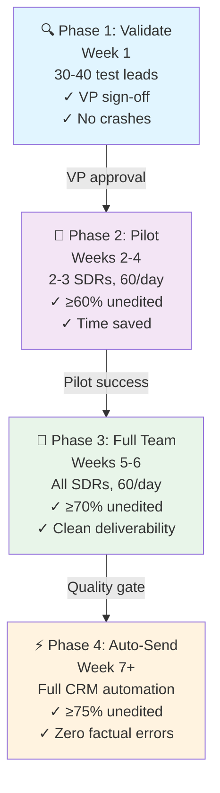

# Rollout Plan

> **Audience:** Revenue Leadership, SDR Managers, RevOps

---

## Philosophy

An SDR sending a bad cold email because the tool hallucinated a rating is worse than no tool at all. The rollout is designed to earn trust at each step before expanding scope. We move deliberately from **validate → semi-automate → full team → fully automate**, with a clear quality gate at each transition.

---

## Phase Overview

| Phase | Timeline | Scope | Success Criteria | Owner |
|-------|----------|-------|------------------|-------|
| **1. Validate** | Week 1 | 30–40 test leads | VP sign-off on accuracy | Engineering + RevOps |
| **2. Pilot** | Weeks 2–4 | 2–3 SDRs, 60 leads/day | ≥60% unedited sends | SDR Manager + Pilot Team |
| **3. Full Team** | Weeks 5–6 | All SDRs, 60 leads/day | ≥70% unedited + clean deliverability | SDR Manager + Full Team |
| **4. Auto-Send** | Week 7+ | Full automation via CRM | ≥75% unedited + zero factual errors | Engineering + RevOps |

---

## Phase Progression Timeline

---

## Phase 1 — Internal Validation 🔍

**Timeline:** Week 1  
**Scope:** Internal team only (no SDRs)  
**Success Criteria:** VP sign-off on accuracy + no crashes on bad data

Before any SDR touches this in a real workflow, run it against leads where we already know the outcome.

### Test Data
- **10–15** closed-won deals
- **10–15** deals that went nowhere
- **5–10** Grade A/B candidates from current pipeline

### Quality Checks
- ✓ Do closed-won accounts score in the top quartile? (closed-lost should cluster below 50)
- ✓ Every email references **real, correct data** (no hallucinated numbers)
- ✓ Geocoding succeeds for all test addresses (identify failure patterns)
- ✓ Batch processor runs on all 30+ leads without crashes

### Go/No-Go Decision
- **PROCEED if:** Results roughly track reality, accuracy ≥80%, no crashes  
- **FIX FIRST if:** Enterprise deal scores F, or ≥20% of test emails contain incorrect facts

---

## Phase 2 — Semi-Automated Pilot 👥

**Timeline:** Weeks 2–4  
**Scope:** 2–3 SDRs, ~60 leads/day  
**Success Criteria:** ≥60% of emails sent without edits

### What "Semi-Automated" Means
The tool generates enrichment, score, pain points, and a draft email. **SDRs review, tweak if needed, then manually send.** No autonomous sending during this phase.

### Pilot Team
- **2–3 pilot SDRs** (include at least one skeptic, not just early adopters)
- **SDR Manager** (weekly check-ins, go/no-go decisions)
- **RevOps** (tracking sheet, API budget)

### Daily Workflow
| Time | Task | Duration |
|------|------|----------|
| 9:00 AM | Run batch on 60 prioritized leads (or load overnight pre-scored) | 15 min |
| 9:15 AM – 3:00 PM | Review queue: read email, verify numbers, tweak if needed, send | 10 leads/hr |
| 5:00 PM | Log: "sent as-is" / "sent with edits" / "skipped" + reasons | 5 min |

### What We Learn From the Pilot

| Metric | What It Tells Us |
|--------|-----------------|
| **Edit distance** | Heavy rewrites = arc or data issue |
| **Skip log** | Track patterns: "wrong property type", "stale data", "too small" |
| **Geocoding failures** | Flag failed addresses; patterns reveal format issues |
| **Arc trust scores** | Which arcs SDRs send as-is vs. always rewrite |

> **Tip:** Weekly 30-min check-ins with pilot SDRs yield more insights than any dashboard — they'll tell you exactly what's broken.

---

## Phase 3 — Full Team Rollout 🚀

**Timeline:** Weeks 5–6  
**Scope:** All SDRs, ~60 leads/day  
**Success Criteria:** ≥70% unedited sends + clean deliverability metrics

### Go/No-Go Criteria (From Phase 2)
✓ Pilot shows no major accuracy issues  
✓ SDRs self-report meaningful time savings (≥15 min/lead)  
✓ ≥60% of emails sent unmodified

### Onboarding for Full Team
- **30-minute training session** covering the SDR Guide
- **Slack channel** for questions, bugs, feature requests
- **Simple rule:** "If the email mentions a number, you can verify it before sending"

### Outreach Schedule (Locked In)
| Aspect | Details |
|--------|---------|
| **Lead Batch** | Score overnight or morning; target top 60 by Lead Score |
| **Send Window** | 9:00 AM – 3:00 PM |
| **Pacing** | 10 emails/hour, random spacing 2–8 min between sends |
| **Cadence** | Mirrors human SDR rhythm; avoids spam-filter triggers |

---

## Phase 4 — Automated Sending ⚡

**Timeline:** Week 7+  
**Scope:** Full automation via CRM API  
**Success Criteria:** ≥75% unedited + zero factual error complaints

### Go/No-Go Criteria (From Phase 3)
After 3–4 weeks of semi-automated sending:
- ✓ ≥70% of emails go out without SDR edits
- ✓ No factual error complaints from prospects
- ✓ Deliverability metrics clean (open rate, spam complaints, bounce rate)

### Technical Setup
Wire up automated sending via **CRM API** (Outreach.io, Apollo, or HubSpot sequences):
- Tool pushes pre-scored emails into send queue
- Scheduler fires at optimal intervals
- SDRs shift to **reply management & meeting booking** (not queue management)

---

## A/B Testing Program (Starts Week 5)

The tool assigns every email a `story_arc` field. Use this to run a continuous improvement loop.

### Round 1 (Weeks 5–8): Arc vs. reply rate

Group outcomes by arc and measure which hooks get responses:

| Arc | Description | Hypothesis |
|-----|-------------|-----------|
| `reputation_gap` | Low Google rating → residents expect better | Highest reply rate — concrete pain, easy to validate |
| `growth_strain` | Recent acquisition or expansion news | High reply rate — timely trigger |
| `operational_friction` | Bad weather, high crime, maintenance load | Medium — resonates with operators, not always decision-makers |
| `premium_expectations` | Premium market, residents expect instant responses | Medium — depends on price sensitivity |
| `lead_speed` | High vacancy urgency, tight market | Lower — feels generic without a specific trigger |

After 200 sends across arcs, compare reply rates. If `reputation_gap` outperforms `lead_speed` by 2×, raise the score threshold that triggers the reputation arc.

### Round 2 (Weeks 9–12): Subject line experiments

Split leads of the same arc into two subject line styles:
- **Data-led:** "Your 2.8-star Google rating in a Walk Score 97 building"
- **Question-led:** "Are your residents getting the response speed they expect?"

Track open rate per variant. 150 sends per variant gives statistical signal.

### Round 3 (Week 13+): Send time optimization

Does 9am outperform 1pm for your specific ICP? The tracking schema captures `sent_at` — segment reply rates by hour and optimize the send window.

---

## Success Metrics

| Timeframe | What we're measuring | Target |
|-----------|---------------------|--------|
| End of pilot (Week 4) | SDRs self-report time saved per lead | ≥15 min saved vs. manual research |
| 8 weeks | Grade A/B leads book meetings at higher rate than C/D | A/B reply rate ≥ 2× C/D |
| 12 weeks | Emails sent without SDR edits | ≥75% go out unmodified |
| 16 weeks | Tool is the default step before any outbound email | No new outbound sent without a tool-generated score |

---

## Who Owns What

| Role | Responsibility |
|------|---------------|
| **SDR Manager** | Pilot SDR selection, weekly check-ins, go/no-go calls at each phase transition |
| **RevOps** | API keys, spend monitoring, tracking sheet setup, eventual CRM integration |
| **Engineering** | Fix geocoding failures, iterate on scoring weights and LLM prompts from pilot feedback |
| **2–3 Pilot SDRs** | Use the tool on every new outbound lead during pilot; flag anything weird |

---

## Cost at Scale

Assuming full automation on 60 sends/day, 5 days/week:

| Item | Cost | Notes |
|------|------|-------|
| Anthropic (Haiku + Sonnet) | ~$0.02–0.05/lead | Haiku for pain points (~$0.003), Sonnet for email (~$0.015) |
| **Alternative: Groq** | **$0.00** | Free tier covers both steps; quality slightly below Sonnet |
| NewsAPI developer plan | $449/mo | Only needed if running >100 leads/day on news |
| Intellipins | $100–$500/mo | 5000-150000 calls. Free tier covers 1000 calls/mo |
| Google Places | ~$0.017/lead | 2 calls × $0.0085; $200 free credit covers ~11,700 leads |
| All other APIs | $0 | Free tiers more than sufficient at SDR-scale |
| **Total at 60 leads/day (Anthropic)** | **~$1.20–3.00/day** | ~$30–75/month |
| **Total at 60 leads/day (Groq)** | **~$0.00–1.50/day** | Google Places is the only real cost |

At any meaningful conversion rate, the pipeline cost per booked meeting is effectively zero.
